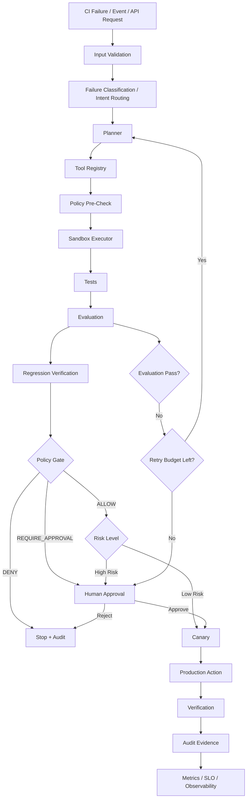

# AI Agent Production Roadmap — CI Failure Orchestrator

> HackMD / GitHub 共用筆記  
> 目標：把目前的 CI Failure Orchestrator 從「有 Agent / Reliability 架構」升級成「可部署、可觀測、可治理、可稽核、有 Production Evidence」的 Agentic Reliability Control Plane。

---

## 1. 專案定位

目前專案已經不只是一般的 AI Agent Demo。

更合適的定位：

- **AI Agent Reliability / Evaluation Engineer**
- **Agentic AI Control Plane Engineer**
- **Production AI / Agent Reliability Portfolio**

核心價值不是「讓 LLM 會呼叫工具」，而是：

```text
Failure
→ Classification
→ Proposal
→ Sandbox
→ Evaluation
→ Regression Verification
→ Retry Budget
→ Policy Gate
→ Human Escalation
→ Production Action
→ Audit Evidence
```

最終目標：

> The agent is correct, observable, recoverable, governed, auditable, cost-aware, and safe to operate.

---

## 2. 與一般 AI Agent Roadmap 的差異

一般 AI Agent Roadmap 常見內容：

- Python / JavaScript / Git
- LLM APIs
- LangChain / LangGraph / LlamaIndex
- Tool Calling
- RAG
- Memory
- Vector DB
- FastAPI
- Docker
- Cloud Deployment

本專案應進一步補強：

- Evaluation
- Regression Verification
- Retry Budget
- Policy Gate
- Human Approval
- Durable State
- Observability
- SLI / SLO
- Canary
- Rollback
- Cost Control
- Audit Evidence
- Production Proof

---

## 3. Target Architecture



---

## 4. 建議升級階段

### Phase 1 — Production API + Durable State

目標：

- FastAPI
- Typed request / response models
- PostgreSQL
- run / attempt persistence
- crash recovery
- health / readiness endpoint

Acceptance Criteria：

- process restart 後 run state 不遺失
- API 有 OpenAPI docs
- 所有 run 都有唯一 `run_id`
- workflow / attempt / tool execution 可追蹤

---

### Phase 2 — Evaluation + Retry Budget

目標：

- deterministic evaluation
- LLM-based evaluation（需要時）
- Golden Dataset
- regression verification
- bounded retry

建議 Evaluation schema：

```json
{
  "task_success": true,
  "correctness_score": 0.94,
  "regression_detected": false,
  "policy_pass": true,
  "latency_ms": 2130,
  "estimated_cost_usd": 0.012
}
```

Retry flow：

```text
attempt 1
→ evaluation failed
→ retry

attempt 2
→ regression detected
→ retry

attempt 3
→ retry budget exhausted
→ human escalation
```

---

### Phase 3 — Policy + Human Approval

建立明確 Policy Engine。

可能結果：

- `ALLOW`
- `DENY`
- `REQUIRE_APPROVAL`

高風險行為範例：

- destructive file change
- production deployment
- secret access
- database mutation
- external API write
- high-cost model execution

Human Approval 畫面至少要能看到：

- proposed change
- reason
- evidence
- test result
- evaluation result
- regression result
- risk level
- estimated impact

---

### Phase 4 — Observability + SLO

加入：

- structured logging
- OpenTelemetry-compatible tracing
- metrics
- cost tracking

重要欄位：

- `run_id`
- `workflow_id`
- `agent_id`
- `attempt_id`
- `tool`
- `latency`
- `retry_count`
- `evaluation_result`
- `policy_decision`
- `token_usage`
- `estimated_cost`

建議 SLI / SLO：

```text
Task success rate >= 95%
Policy violations = 0
Regression escape rate < 1%
P95 latency < defined threshold
Human escalation rate tracked
Mean recovery time tracked
```

---

### Phase 5 — Canary + Rollback

安全 rollout：

```text
New policy / agent version
→ 5%
→ observe
→ 25%
→ observe
→ 50%
→ observe
→ 100%
```

若：

- error rate 上升
- regression rate 上升
- latency 大幅惡化
- cost 超標
- SLO breach

則：

```text
automatic rollback
```

---

### Phase 6 — Security + Audit Evidence

Security：

- secret management
- RBAC-ready authorization
- prompt injection defenses
- tool permission boundary
- dependency scanning
- input validation

每次 workflow 產生 audit evidence：

```json
{
  "run_id": "...",
  "input_hash": "...",
  "proposal_hash": "...",
  "tests": {},
  "evaluation": {},
  "policy_decision": "ALLOW",
  "human_approval": null,
  "final_result": "...",
  "timestamp": "..."
}
```

原則：

> 不可以把 secret 寫入 log 或 audit evidence。

---

### Phase 7 — Deployment + Production Proof

至少提供：

- Dockerfile
- docker-compose.yml
- API
- PostgreSQL
- worker
- optional Redis
- observability integration

Cloud example：

- AWS
- Azure
- GCP
- Railway
- Render

避免過度綁定單一 cloud vendor。

Production Evidence 應收集：

- total runs
- success rate
- failure taxonomy
- retry distribution
- escalation rate
- regression rate
- latency
- cost per run

**禁止捏造 production metrics。**

沒有真實資料時必須標示：

- `SIMULATED`
- `TEST`
- `DEMO`

---

# 5. Coding Agent Upgrade Prompt

以下 Prompt 可直接貼到 Cursor / Windsurf / Claude Code / Codex。

```text
You are a Staff-level AI Platform / Agent Reliability Engineer.

Your task is to review and upgrade my existing GitHub repository into a production-ready AI Agent system.

Do NOT rewrite the project from scratch.
Preserve the current architecture where reasonable, but identify missing production capabilities and implement them incrementally.

My target positioning is:

AI Agent Reliability / Evaluation Engineer
or
Agentic AI Control Plane Engineer

The system should go beyond a simple LLM agent or RAG chatbot.

Target architecture:

User / Event / CI Failure
        ↓
Input Validation
        ↓
Failure Classification / Intent Routing
        ↓
Agent Planning
        ↓
Tool Selection / Function Calling
        ↓
Policy Check
        ↓
Sandbox Execution
        ↓
Evaluation
        ↓
Regression Verification
        ↓
Retry Budget
        ↓
Canary / Safe Rollout
        ↓
Human Approval / Escalation
        ↓
Production Execution
        ↓
Audit Evidence
        ↓
Observability / SLO Dashboard

Please review the current repository first and classify every capability as:

1. Already implemented
2. Partially implemented
3. Missing
4. Implemented but not production-ready

Then create an upgrade plan.

Focus especially on the following areas:

A. API layer
- FastAPI
- typed request/response models
- validation
- health endpoint
- readiness endpoint
- versioned API
- structured error handling
- OpenAPI documentation

B. Durable state
Use PostgreSQL where appropriate.

Persist:
- run_id
- workflow_id
- agent_id
- attempt_id
- failure_class
- proposal
- tool calls
- evaluation results
- policy decisions
- approvals
- retry count
- final outcome
- timestamps

The system must survive process restarts.

C. Agent execution model
Separate:

Planner
Executor
Evaluator
Policy Engine
Human Escalation

Avoid one giant agent function.

Each component must have a clear interface and typed contract.

D. Tool calling
Create a tool registry.

Each tool must define:

- name
- description
- input schema
- timeout
- permissions
- retry policy
- risk level
- audit requirements

Prevent arbitrary tool execution.

E. Sandbox execution
Agent-generated changes must NOT immediately affect production.

Flow:

Proposal
→ Sandbox
→ Test
→ Evaluation
→ Regression check
→ Policy gate
→ Approval
→ Production

Include timeout and resource limits.

F. Evaluation framework
Add deterministic and LLM-based evaluation where appropriate.

Support:

- correctness
- regression
- safety
- policy compliance
- latency
- cost
- task success rate

Add Golden Dataset support.

Evaluation output should be machine-readable.

G. Retry budget
Do not retry forever.

Implement:

MAX_RETRIES
retry reason
retry count
retryable / non-retryable classification

H. Policy engine
Create policy gates before risky actions.

Possible outcomes:

ALLOW
DENY
REQUIRE_APPROVAL

I. Human-in-the-loop
Create an approval workflow.

Human should see:

- proposed change
- reason
- evidence
- evaluation result
- regression result
- risk level
- estimated impact

Possible actions:

Approve
Reject
Request Changes

J. Observability
Add structured logging and tracing.

Prefer OpenTelemetry-compatible design.

Track:

- run_id
- agent_id
- tool
- latency
- retry
- evaluation result
- policy decision
- token usage
- estimated cost

Do not log secrets.

K. Reliability metrics
Define measurable SLI/SLOs.

Example:

Task success rate >= 95%
Policy violations = 0
Regression escape rate < 1%
P95 agent latency < defined threshold
Human escalation rate tracked
Mean recovery time tracked

Create a metrics endpoint or dashboard-ready output.

L. Canary deployment
Add a safe rollout concept.

Example:

new agent policy
→ 5% traffic
→ observe
→ 25%
→ 50%
→ 100%

If metrics degrade:

automatic rollback

M. Cost control
Implement:

per-run cost tracking
per-agent budget
daily budget
model selection policy

N. Security
Add:

secret management
RBAC-ready authorization
input validation
prompt injection defenses
tool permission boundaries
audit logging
dependency scanning

Never hard-code secrets.

O. Audit Evidence
Every workflow should generate an immutable or append-only evidence record.

P. Production deployment
Add:

Dockerfile
docker-compose.yml

Local stack should preferably include:

API
PostgreSQL
worker
optional Redis
observability

Also provide an example cloud deployment architecture for:

AWS / GCP / Azure / Railway / Render

Do not tightly couple the system to one cloud vendor.

Q. Failure injection testing
Create tests that deliberately simulate:

- API timeout
- malformed LLM output
- database outage
- tool failure
- regression
- policy denial
- retry exhaustion
- worker crash

Verify graceful recovery.

R. Architecture documentation
Create:

docs/architecture.md
docs/reliability.md
docs/evaluation.md
docs/security.md
docs/runbook.md

Include Mermaid diagrams.

S. ADRs
Create Architecture Decision Records for major choices.

Examples:

ADR-001 Durable State
ADR-002 Agent Execution Model
ADR-003 Evaluation Strategy
ADR-004 Policy Engine
ADR-005 Human Approval
ADR-006 Observability

T. Production evidence
Create a framework to collect operational evidence over time.

Generate reports for:

- total runs
- success rate
- failure taxonomy
- retry distribution
- escalation rate
- regression rate
- latency
- cost per run

Do NOT fabricate production metrics.

Important engineering rules:

1. Do not over-engineer unnecessarily.
2. Prefer small incremental PR-sized changes.
3. Preserve backwards compatibility when practical.
4. Add tests for each important capability.
5. Do not claim a feature exists unless the code proves it.
6. Separate architecture documentation from implementation status.
7. Avoid fake "enterprise-ready" claims.
8. Every production claim must point to evidence in code, tests, logs, or metrics.

Before writing code, produce:

## Repository Assessment

| Capability | Current Status | Evidence | Gap | Priority |

Then produce:

## Target Architecture

with a Mermaid diagram.

Then produce:

## Upgrade Phases

Phase 1 — Production API + Durable State
Phase 2 — Evaluation + Retry Budget
Phase 3 — Policy + Human Approval
Phase 4 — Observability + SLO
Phase 5 — Canary + Rollback
Phase 6 — Security + Audit Evidence
Phase 7 — Deployment + Production Proof

For every phase provide:

- goal
- files to modify
- new files
- tests required
- acceptance criteria
- risks

Then begin with Phase 1 only.

Do not implement all phases at once.

At the end of each phase output:

## Verification

Commands I can run locally.

Then output:

## Staff-Level Signals Added

Explain what engineering maturity this phase demonstrates.

The final goal is not merely:

"the agent works"

The final goal is:

"The agent is correct, observable, recoverable, governed, auditable, cost-aware, and safe to operate."
```

---

## 6. 建議執行順序

不要一次叫 Agent 把全部做完。

建議：

```text
Step 1
Repository Assessment only

Step 2
Phase 1 implementation

Step 3
Run tests + review diff

Step 4
Phase 2

Step 5
Repeat until Phase 7
```

每一個 Phase 建議維持在：

- 一個清楚的 branch
- 一個 PR
- 一組 acceptance criteria
- 一組 regression tests

---

## 7. Portfolio 最終組合

建議將三個 repo 形成一個完整故事：

### CI Failure Orchestrator
**Agentic Reliability Control Plane**

負責：

- orchestration
- retry
- policy
- escalation
- remediation
- audit

### EvalForge
**Evaluation / Regression / Policy Validation Layer**

負責：

- Golden Set
- evaluator
- regression
- metrics
- policy verification

### Windows Network Recovery Toolkit
**Real-world Remediation Domain**

負責：

- 真實故障診斷
- remediation workflow
- evidence collection
- operational use case

整體故事：

```text
Real Failure
   ↓
CI / Agent Orchestration
   ↓
Sandbox
   ↓
EvalForge
   ↓
Policy / Human Gate
   ↓
Verified Remediation
   ↓
Audit Evidence
```

這比單純展示一個 RAG chatbot 更接近企業級 AI Agent Engineering。
