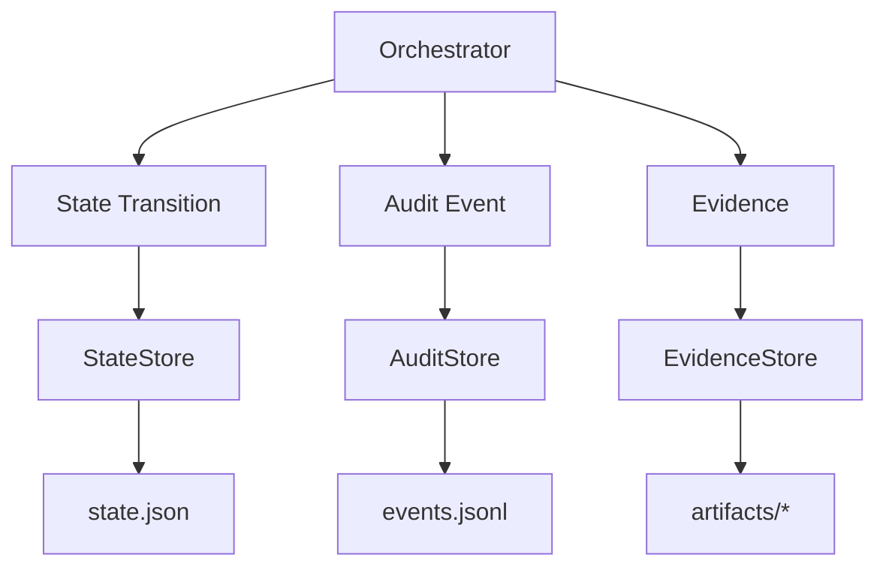

# Durable State + Audit Evidence (Phase 10)

Local filesystem persistence for foundation runs. Makes runs recoverable,
inspectable, and auditable — not a distributed workflow engine.

## Principles

- Persist major workflow transitions
- Append-oriented audit log (`events.jsonl`)
- Evidence as separate artifacts with relative refs
- Sanitize before write
- Fail closed on persistence errors
- Resume is conservative (no blind side-effect replay)

Integrity wording: this is an **append-oriented audit log**, not a
cryptographically tamper-proof / WORM / regulatory ledger.

## Architecture



## Layout

```text
artifacts/runs/<run-id>/
├── state.json
├── events.jsonl
├── input/
├── classification/
├── plans/
├── attempts/
├── proposals/
├── sandbox/
├── evaluations/
├── retry/
├── policy/
├── tools/
└── escalation/
```

## DurableRunState fields

`schema_version`, `run_id`, `workflow_status`, `technical_status`,
`policy_outcome`, `current_attempt`, timestamps, evidence refs
(`failure_event_ref`, `classification_ref`, `current_plan_ref`,
`current_proposal_ref`, `latest_evaluation_ref`, `latest_policy_decision_ref`,
`latest_retry_decision_ref`, `escalation_ref`), `last_event_sequence`,
`stop_reason`, `evidence_index`.

## AuditEvent fields

`schema_version`, `event_id`, `run_id`, `sequence`, `timestamp`, `event_type`,
`actor`, `component`, `state_before`, `state_after`, `evidence_refs`, `metadata`.

Sequences start at **1** and increase monotonically. Resume continues from the
last persisted sequence. Duplicate `event_id` values are rejected.

## Event types emitted

`RUN_CREATED`, `RUN_RESUMED`, `CONTEXT_BUILT`, `FAILURE_CLASSIFIED`,
`PLAN_CREATED`, `ATTEMPT_STARTED`, `TOOL_CALLED`, `TOOL_COMPLETED`,
`PROPOSAL_CREATED`, `SANDBOX_STARTED`, `SANDBOX_COMPLETED`,
`EVALUATION_COMPLETED`, `RETRY_DECIDED`, `RETRY_STARTED`, `RETRY_STOPPED`,
`POLICY_REVIEW_STARTED`, `POLICY_APPROVED`, `POLICY_REJECTED`,
`POLICY_ESCALATED`, `ESCALATION_PACKAGE_CREATED`, `AWAITING_HUMAN`,
`RUN_SUCCEEDED`, `RUN_FAILED`.

## Crash recovery

| State | Resume behavior |
| --- | --- |
| RECEIVED / CONTEXT_READY / CLASSIFIED / PLANNED / PROPOSAL_READY / EVALUATED / RETRY_* / POLICY_REVIEW | `RESUMABLE` (marker only; no auto side effects) |
| EXECUTING / SANDBOX_RUNNING / EVALUATING / ESCALATED / ESCALATION_BUILDING | `REQUIRES_REVIEW` |
| APPROVED / REJECTED / AWAITING_HUMAN / FAILED / SUCCEEDED / ESCALATION_ERROR | `TERMINAL` |

`resume_run` loads state, verifies consistency, and for `RESUMABLE` emits
`RUN_RESUMED` without re-running tools. `AWAITING_HUMAN` never continues
automation.

## Consistency checks

- Missing referenced artifacts
- State/event sequence mismatch
- Sequence gaps
- Trailing corrupt JSONL line
- Missing evaluation event when state implies evaluated
- `AWAITING_HUMAN` without escalation artifact

## Sanitization / truncation

Phase 3 `sanitize_text` on persisted strings. Evidence limits bound stdout,
stderr, logs, patches. Truncation records
`truncated` / `original_length` / `stored_length` when known.

## Enablement

Persistence activates when `AgentExecutionFoundation(artifacts_root=...)` is set
(or `enable_persistence=True` with a root). Without a root, Phase 2–9 behavior
is unchanged (in-memory only).

## APIs

```python
inspect_run(artifacts_root, run_id)
replay_events(artifacts_root, run_id)
resume_run(artifacts_root, run_id)
verify_run_consistency(artifacts_root=..., run_id=...)
```

## Example timeline

```text
#1 RUN_CREATED
#2 CONTEXT_BUILT
#3 FAILURE_CLASSIFIED
#4 ATTEMPT_STARTED
#5 PLAN_CREATED
#6 TOOL_CALLED / TOOL_COMPLETED …
#7 PROPOSAL_CREATED
#8 SANDBOX_STARTED
#9 SANDBOX_COMPLETED
#10 EVALUATION_COMPLETED
#11 POLICY_REVIEW_STARTED
#12 POLICY_ESCALATED
#13 ESCALATION_PACKAGE_CREATED
#14 AWAITING_HUMAN
```

## Security notes

Redacted artifacts may still contain sensitive engineering context. Restrict
filesystem permissions; do not commit `artifacts/` (gitignored). No enterprise
access control in Phase 10.

## Limitations

- Local filesystem only
- Not tamper-proof
- No distributed locking / multi-worker coordination
- No regulatory compliance claims
- Resume does not auto-continue side-effecting steps
