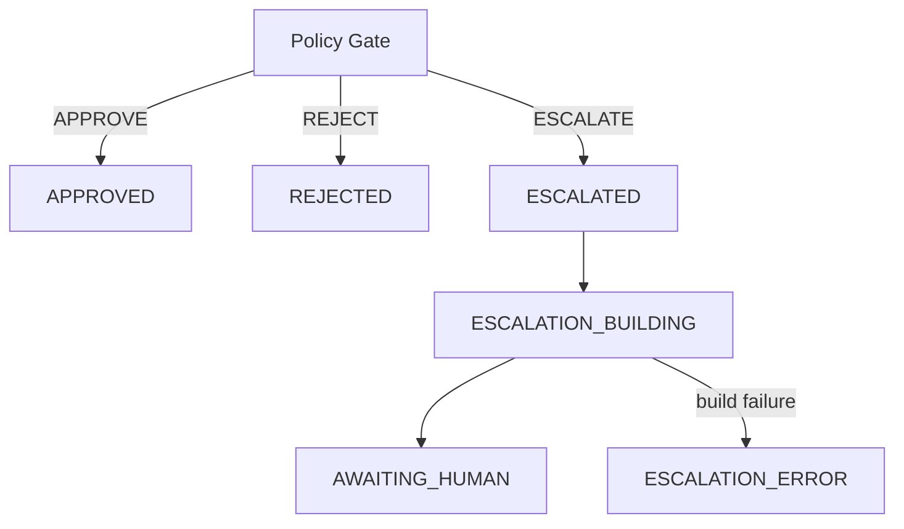

# Human Escalation (Phase 9)

Turns `PolicyOutcome.ESCALATE` into a structured, sanitized, review-ready
evidence package. Answers:

```text
What exactly should a human review, and why?
```

Does **not** decide for the human, notify channels, or apply patches.

## Trigger

```text
Policy Gate → ESCALATE
        ↓
HumanEscalationBuilder
        ↓
Sanitized JSON + Markdown artifacts
        ↓
AWAITING_HUMAN  (terminal for Phase 9)
```

`APPROVE` and `REJECT` do **not** create escalation packages.

## Flow



## HumanEscalation model

Includes: escalation/run IDs, reason codes, risk level (same as Policy Gate),
failure/proposal/evaluation/attempt/policy summaries, affected files, unresolved
questions, category-specific checklist, reviewer actions, evidence refs, and
evidence completeness.

## Review package layout

```text
artifacts/runs/<run-id>/escalation/
  summary.json
  summary.md
  evidence-index.json
  proposed.patch
  evaluation-summary.json
```

## Evidence completeness

`COMPLETE` | `PARTIAL` | `INCOMPLETE` — based on presence of required fields,
not a score. Incomplete packages are labeled clearly; build exceptions map to
`ESCALATION_ERROR` (fail closed — never auto-approve).

## Sanitization

Artifacts pass through Phase 3 `sanitize_text` (bearer tokens, passwords, private
keys, etc.). Large patches are truncated with an explicit marker. Sanitization is
defense-in-depth, not a guarantee.

## Reviewer actions (declared only)

`APPROVE` | `REJECT` | `REQUEST_CHANGES` | `DEFER`

`ReviewerDecision` is defined for future wiring and is **not** consumed by the
orchestrator in Phase 9.

## Example package (sanitized)

```text
# Human Review Required

Run: run-123

## Reason

Authorization-related code changed.

## Technical Result

PASS

## Policy Result

ESCALATE

## Files

- auth/permissions.py
- tests/test_permissions.py

## Risk

HIGH

## Attempts

2

## Unresolved Questions

- Does the new logic preserve all existing role boundaries?
- Are negative authorization cases sufficiently covered?

## Review Checklist

- [ ] Review privilege boundaries
- [ ] Review deny paths
- [ ] Review negative tests
- [ ] Confirm no unintended privilege expansion

## Available Actions

- APPROVE
- REJECT
- REQUEST_CHANGES
- DEFER
```

No recommended reviewer decision is included.

## Phase 10 boundary

Durable audit journals and distributed state are deferred. Phase 9 writes local
filesystem artifacts only.

## Package

`ci_failure_orchestrator.foundation.escalation`
