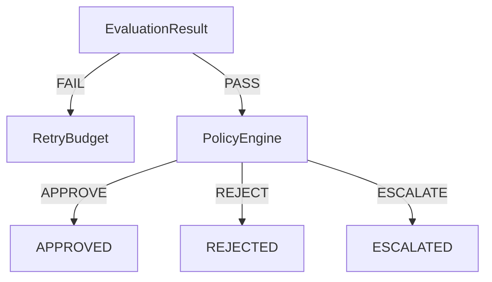

# Policy Gate (Phase 8)

Deterministic governance after technical evaluation. Answers:

```text
Should this technically valid repair be allowed to proceed?
```

Does **not** answer how humans review escalations (Phase 9). Does **not** apply
patches to the primary workspace.

## Technical vs governance success

| Technical (`EvaluationResult.passed`) | Governance (`PolicyOutcome`) | Terminal status |
| --- | --- | --- |
| FAIL | (retry owns path) | `FAILED` (if stopped) |
| PASS | `APPROVE` | `APPROVED` |
| PASS | `REJECT` | `REJECTED` |
| PASS | `ESCALATE` | `ESCALATED` |

Tests passing is **necessary but not sufficient** for `APPROVE`.

## Outcomes

```text
APPROVE  — satisfies configured low-risk allow rules
REJECT   — hard policy violation; must not proceed
ESCALATE — not auto-prohibited; requires later human review (Phase 9)
```

`ESCALATE` is **not** `APPROVE`. It must not mutate production.

## Flow

```text
EvaluationResult
      │
      ├── FAIL
      │     ↓
      │   Retry Budget
      │
      └── PASS
            ↓
       Policy Engine
       ┌────┼────┐
       │    │    │
    APPROVE REJECT ESCALATE
```



## Rule precedence

1. Hard reject  
2. Mandatory escalation  
3. Explicit low-risk allow  
4. Default conservative (`ESCALATE`)

Hard reject overrides escalation and approval. Escalation overrides auto-approval.

## Fail-closed behavior

Unexpected Policy Engine errors map to **`ESCALATE`** (`POL-013-ENGINE-FAILURE`).
They never silently `APPROVE`.

## Risk categories

Deterministic `LOW | MEDIUM | HIGH | CRITICAL` from file categories, scope, and
tool risk metadata — not a probabilistic score.

## Changed-file classification

Path-based: `SOURCE`, `TEST`, `DOCUMENTATION`, `CI`, `DEPENDENCY`, `SECURITY`,
`AUTH`, `INFRASTRUCTURE`, `MIGRATION`, `CONFIGURATION`, `UNKNOWN`.

`UNKNOWN` increases conservatism (typically escalate).

## Tool risk integration

Consumes Phase 4 `ToolRiskLevel` (`READ_ONLY`, `SAFE_WRITE`, `RESTRICTED`).
Restricted tools with non-`SMALL` scope escalate when configured.

## Dependency / CI / security policy

- Dependency manifests/lockfiles → escalate (`POL-007`)  
- CI workflows (e.g. `.github/workflows/`) → escalate (`POL-004`)  
- Auth/security-sensitive paths → escalate (`POL-003` / `POL-009`)  
- Forbidden paths (`.env`, `secrets/`, `.git/`, `id_rsa`) → reject (`POL-002`)

Path/config detection only — no semantic security analyzer.

## Example configuration

Constructor injection via `PolicyConfig` (no new config framework):

```python
PolicyConfig(
    default_outcome=PolicyOutcome.ESCALATE,
    forbidden_paths=(".env", "secrets/", ".git/", "id_rsa"),
    escalation_paths=(".github/workflows/", "auth/", "infra/", "migrations/"),
    auto_approve_max_files=3,
    auto_approve_categories=(FileCategory.SOURCE, FileCategory.TEST, FileCategory.DOCUMENTATION),
    auto_approve_risk_levels=(GovernanceRiskLevel.LOW,),
)
```

## Phase 9 boundary

`PolicyDecision(outcome=ESCALATE, ...)` is the handoff. Phase 9 owns review
queues, notifications, UI, and human decision persistence — not implemented here.

## Package

`ci_failure_orchestrator.foundation.policy` — models + `StaticPolicyEngine`  
Wired in `AgentExecutionFoundation` after evaluation PASS.
