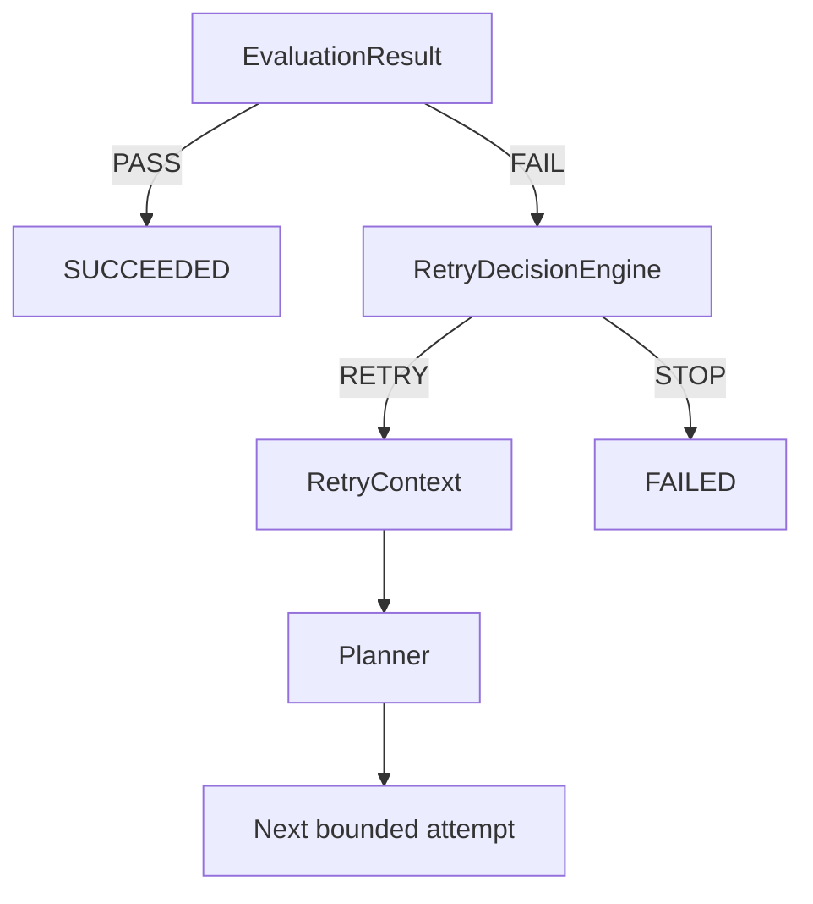

# Retry Budget (Phase 7)

Bounded, explainable, deterministic retries between evaluation failure and the
next repair attempt. This is a **control-plane** concern — it does not generate
repairs.

## Why retries are bounded

Unbounded “ask the model again” loops waste tools, amplify duplicate patches,
and hide unrecoverable failures. Phase 7 enforces finite attempts with explicit
stop reasons.

## Attempt semantics

```text
max_attempts = 3  ⇒  attempt 1 (initial) + up to 2 retries
```

Canonical field: **`max_attempts`** (total repair executions). Do not mix with
a separate `max_retries` counter in configuration.

## Flow

```text
EvaluationResult
       │
       ├── PASS ───────────────→ Success (technical; not production approval)
       │
       └── FAIL
             ↓
       RetryDecisionEngine
       ┌─────┴─────┐
       │           │
     RETRY        STOP
       │           │
       ↓           ↓
 RetryContext     Failed
       │
       ↓
    Planner (fresh plan with prior-attempt evidence)
```



## Decision precedence

1. Evaluation passed → **STOP SUCCESS**
2. `used >= max_attempts` → **STOP MAX_ATTEMPTS_EXHAUSTED**
3. Unrecoverable / security / invalid proposal → **STOP**
4. Identical proposal count exceeds budget → **STOP IDENTICAL_PROPOSAL_REPEATED**
5. Identical failure count exceeds budget **and** no progress → **STOP IDENTICAL_FAILURE_REPEATED**
6. Consecutive no-progress streak exceeds budget → **STOP NO_PROGRESS**
7. Partial progress / transient / recoverable → **RETRY**
8. Otherwise → **STOP INSUFFICIENT_EVIDENCE** (conservative)

Orchestration also uses an independent hard loop:

```python
for attempt_number in range(1, budget.max_attempts + 1):
    ...
```

## Duplicate detection

| Kind | Mechanism | Notes |
| --- | --- | --- |
| Proposal | SHA-256 of normalized patch + sorted files | Heuristic; not a security hash |
| Failure | SHA-256 of category, step, stabilized message, failed checks, sandbox error | Heuristic; not root-cause identity |

Normalization strips timestamps on `---`/`+++` lines, temp paths, UUIDs, run IDs.

## Progress detection

`ProgressAssessment` uses evaluator/sandbox evidence only:

- target test FAIL → PASS
- fewer failed checks
- patch now applies
- sandbox error cleared

A different failure fingerprint alone is **not** treated as progress.

## No-progress behavior

Trailing consecutive attempts without `progress.improved` are counted. When the
streak reaches `max_no_progress_attempts`, the engine stops with `NO_PROGRESS`.
Transient dispositions may still retry before that streak is reached if earlier
checks do not stop first.

## Retry-aware context

Context Builder receives compact `previous_attempt` summaries (bounded by
`max_retry_history_entries`). Full historical logs are not re-injected each
retry.

Planner receives optional `RetryContext` (attempt number, prior summaries,
failed approaches, latest evaluation). RetryDecisionEngine does **not** call
the planner or an LLM.

## State machine (Phase 7 additions)

```text
… → EVALUATING → EVALUATED
EVALUATED → SUCCEEDED | RETRY_DECISION | FAILED
RETRY_DECISION → RETRYING | FAILED
RETRYING → PLANNED | FAILED
```

## Interaction with Evaluator

Evaluator remains evidence-only. Retry decisions consume `EvaluationResult` and
`AttemptRecord`s; they do not override check outcomes.

## Future Policy Gate boundary (Phase 8 — implemented)

Phase 7 answers only: *Should we try another repair?*

Phase 8 answers: *May a technically successful repair proceed under policy?*

```text
Evaluation PASS → Policy Gate → APPROVE | REJECT | ESCALATE
```

See [policy-gate.md](./policy-gate.md).
## Package

- `ci_failure_orchestrator.foundation.retry` — budget, fingerprints, engine
- `ci_failure_orchestrator.foundation.runner.AgentExecutionFoundation` — hard-bounded loop
