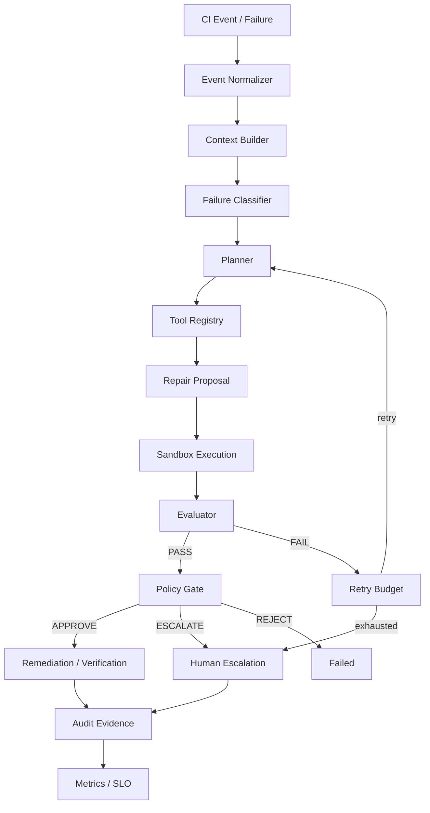

# Target architecture (governed agent pipeline)

Logical target for the production-oriented upgrade. Implementation composes existing modules; this diagram is the **integration contract**, not a claim that every box is a new rewrite.

## Boundaries

| Layer | Responsibility | Must not |
| --- | --- | --- |
| Context Builder | Assemble bounded, redacted evidence | Mutate repo |
| Classifier | Label failure + heuristic confidence | Apply patches |
| Planner | Emit `RepairPlan` steps/tools | Execute tools |
| Tool Registry | Permissioned, schema'd calls | Arbitrary shell |
| Sandbox | Apply + verify in isolation | Touch primary tree without gate |
| Evaluator | Structured pass/fail evidence | Approve release |
| Policy Gate | APPROVE / REJECT / ESCALATE / RETRY | Hide decisions |
| Audit / Store | Durable append-only evidence | Drop correlation IDs |

## Mapping to existing code

| Target box | Existing building block |
| --- | --- |
| Event normalizer | `github_ingest`, `FailedCheck` |
| Classifier | `classifier`, `classify_failed_check` |
| Planner | `repair_planner`, `memory_aware_planner` |
| Tools / sandbox | `trust_gateway`, `worktree`, `execution`, `patch_sandbox` |
| Evaluator | `VerificationResult`, `agent_loop.EvaluationResult`, `EvaluationGate` |
| Retry | `RetryBudget` variants, `DurableRunState.max_attempts` |
| Policy | `supervisor`, `trust_policy`, `policy` |
| Escalation | `HumanApprovalGate`, supervisor authorities |
| Audit | `HashChainedAuditLog` |
| Durable state | `SQLiteRunStore`, completion ledger, incident store |
| Metrics / SLO | `telemetry`, `slo`, `repair_telemetry` |

New `ci_failure_orchestrator.governed` package wires these into one explicit state machine without deleting prior stacks.
