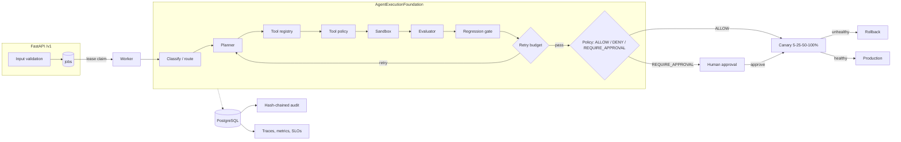

# Agent reliability upgrade plan

This document has two parts that are kept apart on purpose:

- **Plan** (assessment, target architecture, phases): intent. Nothing here is a claim that a
  capability exists.
- **Implementation status**: what the code does today, each line pointing at code and tests.

## Plan

### Repository assessment (October 2026, before Phase 1)

| Capability | Status | Evidence | Gap | Priority |
|---|---|---|---|---|
| Production API | Missing | `api.py` is an in-memory, experimental `ControlPlaneAPI`; CLI only | HTTP API, health/ready, versioning, structured errors | P0 |
| Durable state | Partial | `foundation/durable.py` protocols with File stores | No shared DB, no queue, no crash semantics across processes | P0 |
| Planner / executor / evaluator / policy / escalation split | Implemented | Injected into `AgentExecutionFoundation` (`foundation/runner.py`) | Contracts not versioned at a service boundary | P2 |
| Tool registry | Partial | `ToolSpec`: name, description, input/output schema, risk level, side effect, timeout | Permissions, retry policy, audit flag; schema not enforced at call time | P2 |
| Sandbox | Not production-ready | `TempCopySandboxExecutor`; timeout checked after the fact (`sandbox.py`) | Enforced timeout, CPU/memory/network limits | P1 |
| Evaluation | Partial | Deterministic `LocalEvaluator`; 8 synthetic cases in `benchmarks/cases/` | LLM judge, dataset versioning, regression baseline | P1 |
| Retry budget | Implemented | `foundation/retry.py`, ADR-0005 | Cost and wall-clock budgets | P2 |
| Policy outcomes | Partial | `PolicyOutcome` APPROVE / REJECT / ESCALATE | ALLOW / DENY / REQUIRE_APPROVAL naming; policy as versioned data | P2 |
| Human-in-the-loop | Partial | `foundation/human_decision.py` via `foundation-decide` | API, reviewer identity | P1 |
| Observability | Partial | Redaction in `foundation/sanitization.py`; `otel.py` experimental | Tracing and structured logs on the canonical path | P1 |
| SLI/SLO | Partial | `config/slo.json`, `foundation-slo-check` | Metrics endpoint | P2 |
| Canary | Not production-ready | `canary.py` hooks (experimental) | Staged rollout state, automatic rollback | P3 |
| Cost / model selection | Partial | `agent_router.py`, `tournament.py` (experimental) | Per-run cost accounting | P3 |
| Security | Partial | Redaction, `security.yml`, threat model | AuthN/RBAC, prompt-injection handling | P1 |
| Audit evidence hashes | Partial | Monotonic, unique-ID audit log; "not tamper-proof" (`durable.py`) | Hash chain | P2 |
| Deployment | Missing | — | Dockerfile, compose, cloud examples | P0 |
| Failure injection | Partial | Retry, policy, corrupt-log tests | DB outage, worker crash, API timeout, malformed LLM output | P1 |
| Docs / ADRs | Partial / implemented | `docs/architecture/*`, ADR-0001..0007 | Consolidated reliability docs | P3 |
| Production evidence | Partial | `production_evidence.py` (experimental); synthetic case flags | SIMULATED / TEST / DEMO labels | P2 |

### Target architecture



### Phases

| Phase | Goal | Key acceptance criteria |
|---|---|---|
| 1. Production API + durable state | HTTP submit/read, separate worker, PostgreSQL state | Survives restart; stale lease becomes REQUIRES_REVIEW; existing suite green |
| 2. Evaluation + retry budget | Versioned golden datasets, regression baseline, optional LLM judge, cost/time budgets | Malformed judge output cannot pass a run; baseline drop fails CI |
| 3. Policy + human approval | ALLOW / DENY / REQUIRE_APPROVAL, policy data, `POST /v1/runs/{id}/decisions` | Denied actions never execute; reviewer identity recorded |
| 4. Observability + SLO | OTel spans per stage, `/metrics`, SLO burn check | No secrets in spans/logs; metrics labeled by source |
| 5. Canary + rollback | Persisted 5→25→50→100% rollout, automatic rollback | Rollback at each stage; failed rollback escalates; labeled SIMULATED without a real target |
| 6. Security + audit evidence | API keys → roles, injection handling, audit hash chain, dependency scanning | Tamper detection test; role denial test |
| 7. Deployment + production proof | Cloud examples, consolidated docs, labeled evidence reports | No report claims PRODUCTION without provenance |

## Implementation status

### Phase 1 — done

| Capability | Code | Tests |
|---|---|---|
| Store injection (File stores stay default) | `foundation/persistence.py` `RunPersistence(state_store=, audit_store=, evidence_store=)`; `AgentExecutionFoundation(persistence=)` | `tests/test_durable_store_contract.py::test_foundation_run_through_injected_stores` |
| SQL state + audit stores (same contract as File) | `server/sql_store.py`, schema in `server/db.py` | `tests/test_durable_store_contract.py` (File, SQLite; PostgreSQL in CI `server-postgres` job) |
| Evidence mirrored to SQL with SHA-256 | `server/sql_store.py` `MirroredEvidenceStore` | `test_server_api.py::test_end_to_end_submit_process_and_read` |
| `/health`, `/ready`, `/v1/runs` (POST, list, get, events, evidence), OpenAPI | `server/app.py`, `server/schemas.py` | `tests/test_server_api.py` |
| Structured errors, request IDs, body-size limit, input validation without echoing input | `server/app.py` | `test_validation_errors_are_structured_and_do_not_echo_input`, `test_oversized_body_is_rejected_before_parsing` |
| Idempotent submission (`Idempotency-Key`) | `server/jobs.py` `JobQueue.enqueue` | `test_idempotency_key_replay_and_conflict`, `test_same_body_with_new_key_or_no_key_creates_new_runs` |
| Optional shared bearer token (not RBAC) | `server/app.py` `require_token` | `test_bearer_token_required_when_configured` |
| Lease-based worker, heartbeat, fencing | `server/worker.py`, `server/jobs.py` | `tests/test_server_worker.py` |
| Crash recovery → REQUIRES_REVIEW + audit event | `JobQueue.recover_stale`, `Worker._record_lease_expiry` | `test_crashed_worker_lease_moves_job_to_requires_review_and_is_fenced` |
| Failure injection: DB down, DB outage mid-run, run exception | `server/worker.py` | `test_ready_returns_503_when_database_is_unreachable`, `test_database_outage_mid_run_requires_review`, `test_tool_failure_inside_run_is_recorded_as_failed_with_redacted_error`, `test_tick_reports_storage_unavailable_instead_of_crashing` |
| Secrets: env-only, redacted in repr and logs | `server/settings.py`, `server/logs.py` | `test_bearer_token_required_when_configured` (repr), `test_json_logs_keep_reserved_field_names_and_redact_secrets` |
| Container + compose (API, worker, PostgreSQL) | `Dockerfile`, `docker-compose.yml`, `.env.example` | CI `server-image` job; run once locally (2026-10-05, TEST data from `benchmarks/cases/01_unit_test_failure.json`): `/health` and `/ready` 200, POST 202, replay 200, run COMPLETED with 18 audit events and 12 evidence documents in PostgreSQL |

Known limits (not hidden): schema via `create_all` (no migrations yet); audit table not
tamper-evident; single shared token; the API runs the deterministic foundation pipeline and
does not check out the submitted repository; one run at a time per worker.

### Running it

```bash
pip install -e '.[dev,server]'
pytest -q

cp .env.example .env            # set POSTGRES_PASSWORD
docker compose up --build
curl http://localhost:8000/health
curl http://localhost:8000/ready
curl -X POST http://localhost:8000/v1/runs -H 'Content-Type: application/json' \
  -d '{"failure": {"workflow": "ci", "job": "test", "failed_step": "pytest",
       "message": "AssertionError: expected True got False", "changed_paths": ["src/app.py"]}}'
curl http://localhost:8000/v1/runs/<run_id>
curl http://localhost:8000/v1/runs/<run_id>/events
```

| Variable | Default | Purpose |
|---|---|---|
| `CFO_DATABASE_URL` | `sqlite:///./artifacts/orchestrator.db` | SQLAlchemy URL |
| `CFO_ARTIFACTS_ROOT` | `artifacts` | Evidence files (shared by API and worker) |
| `CFO_API_TOKEN` | unset | Shared bearer token for `/v1` |
| `CFO_MAX_BODY_BYTES` | `1048576` | Request size limit |
| `CFO_LEASE_SECONDS` | `300` | Worker lease length |
| `CFO_POLL_SECONDS` | `2` | Idle poll interval |
| `CFO_WORKER_ID` | `worker-<pid>` | Lease owner and audit actor |

Job status (`QUEUED`, `RUNNING`, `COMPLETED`, `FAILED`, `REQUIRES_REVIEW`) is processing state.
The governed outcome is `workflow_status` (`APPROVED`, `AWAITING_HUMAN`, `REJECTED`, ...).
